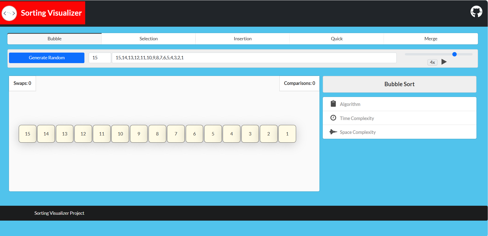

🔥 Sorting Visualizer – Animated Algorithm Explorer

Sorting Visualizer is an interactive visualization tool that lets you actually see how sorting algorithms work.
Each element in the array is represented by a colored bar, and during execution you can watch comparisons, swaps, and merges in real time.

This project is ideal for learning, teaching, and demonstrating the working principles of classic sorting algorithms.

🎯 Motivation

Sorting algorithms are often taught in theory, but it can be difficult to imagine how data moves behind the scenes.
The goal of this project was to create a visual learning aid where students (or interviewers!) can:

Observe how algorithms differ step by step.

Understand time complexity in action.

Experiment with different input sizes and speeds.

✨ Features

✔️ Supports Bubble Sort, Selection Sort, Insertion Sort, Quick Sort, Merge Sort
✔️ Real-time animations with smooth transitions
✔️ Color-coded states (comparison, swap, sorted, inactive)
✔️ Adjustable speed control slider
✔️ Random and custom input generation
✔️ Live statistics panel showing:

Current speed (ms)

Swap count

Comparison count
✔️ Glow effect when sorting completes for extra clarity
✔️ Responsive design – works on desktop & mobile

🛠️ Tech Stack

HTML5, CSS3 – Structure & styling

JavaScript (ES6+) – Sorting logic and animations

jQuery – Interactive UI controls

Bootstrap / Semantic UI / Fomantic UI – Responsive and styled components

FontAwesome – Clean icons for actions

🚀 Getting Started

Clone the repo:

git clone https://github.com/<Abhishek8208>/sorting-visualizer.git

Move into the project directory:

cd sorting-visualizer

Open index.html in any modern browser.
✅ No server setup required.

🎮 How to Use

Select a sorting algorithm from the top menu.

Generate a random array or enter your own custom values.

Adjust the slider to control the speed of visualization.

Press ▶️ Start to run the algorithm.

Watch elements swap, compare, and settle into order while stats update live.

📖 Learning Outcomes

Clear understanding of sorting mechanics.

Hands-on grasp of time vs. space complexity.

Insight into why certain algorithms are better for specific cases.

Practice in JavaScript DOM manipulation and animations.

🚧 Future Improvements

🔹 Add more algorithms (Heap Sort, Radix Sort, Shell Sort).
🔹 Introduce a step-by-step mode for slower learning.
🔹 Provide graph comparisons of algorithm performance.

📸 Demo
  
👨‍💻 Author

Developed & customized by Abhishek Sharma
(Built from scratch with inspiration from multiple algorithm resources)

📜 License

Licensed under the MIT License – free to use and modify.

x

